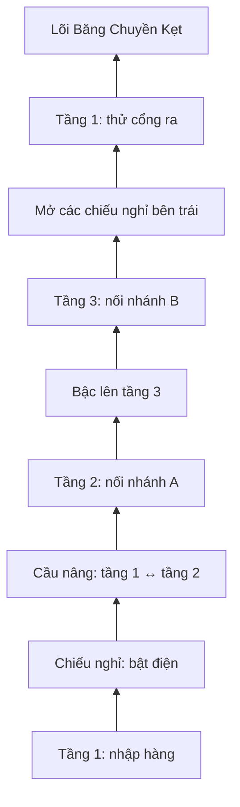

# Kho Phân Loại — bản thử nghiệm map dọc

## Phạm vi và tiêu chí

Giữ game 2D và bộ điều khiển hiện tại. Làm lại ải 2 trước khi mở rộng sang các
ải khác. Không cần sinh thêm hình quái. Bốn ải còn lại giữ cấu trúc đang có.

- Kho rộng 1.100 px, ba tầng chính cách nhau 300 px; camera theo cả hai trục.
- Tiến triển: bật điện ở chiếu nghỉ → đi cầu nâng → nối A ở tầng 2 → nối B ở
  tầng 3 → mở đường vòng xuống sảnh → thử cổng ra và đánh lõi máy.
- Không cần dọn sạch quái. Công tắc thay đổi cầu nâng, nguồn bắn và lối về.
- Lưu checkpoint trong phiên tại mỗi công tắc; giữ trạng thái nhiệm vụ,
  quái/vật phẩm và trang bị đã có tại checkpoint. Chết không bắt leo từ đầu.
- Sàn dưới đỡ cú rơi; đường về chia thành các chiếu nghỉ. Không nhảy mù.
- HUD chỉ điểm tiếp theo, tầng và hướng; cùng một hành động E/nút cảm ứng.

## Thứ tự thực hiện

1. Thêm dữ liệu giới hạn map và tuyến tương tác, camera dọc, cầu nâng và
   checkpoint theo tiến độ; giữ mặc định cho map cũ.
2. Bố trí kho, quái, đồ và biển tầng; nối trạng thái môi trường với HUD.
3. Kiểm tra bằng physics thật: leo từ điểm xuất phát, đi cầu nâng, nhảy lên
   tầng 3, xuống đường vòng và gọi boss khi vẫn còn quái.
4. Kiểm tra pause, nhảy/rời cầu nâng, checkpoint lặp lại, đạn ở tầng cao,
   hồi quy bốn ải và build. Kiểm tra hình và tương tác desktop/mobile.

## Trạng thái

Đã triển khai trong worktree ngày 09/09/2026.

- `npm run test:game`: 52/52 bài qua. Tuyến kho được chạy bằng input và physics
  thật từ điểm xuất phát qua cầu nâng, hai tầng trên, đường vòng và tới boss.
- Đã kiểm tra riêng việc dọn hết quái không bỏ qua nhiệm vụ, camera theo tầng,
  cầu nâng dừng khi pause, nhảy khỏi cầu, đạn tầng cao và checkpoint lặp lại.
- `npm run build`: production build qua, gồm kiểm tra TypeScript.
- Trình duyệt: kiểm tra ảnh tại chặng cầu nâng, tầng 3 và đường về; trang game
  thật hiển thị đúng tên tầng, tiến độ 0/4, hướng mục tiêu và nút cảm ứng ở
  390×844. HUD canvas đã giới hạn câu thông báo và bỏ bộ đếm quái ở tuyến này.
- Chưa cân bằng độ khó bằng một lượt chơi tay không bất tử từ đầu đến cuối.
  Đây là phần cần đánh giá sau khi chơi thử, không phải lỗi traversal.
